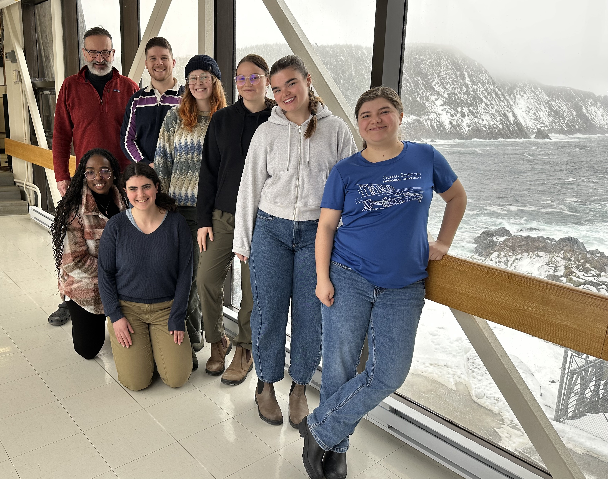
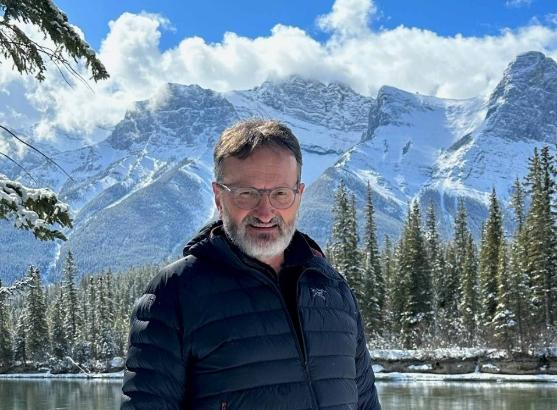
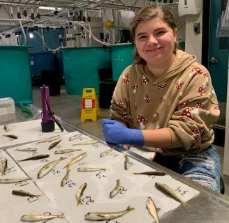
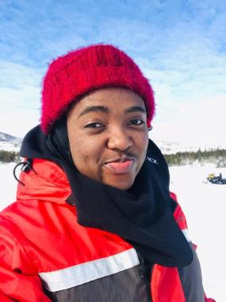
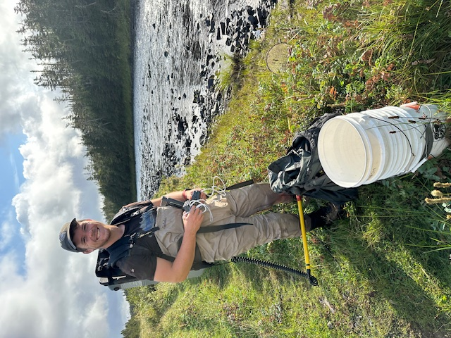
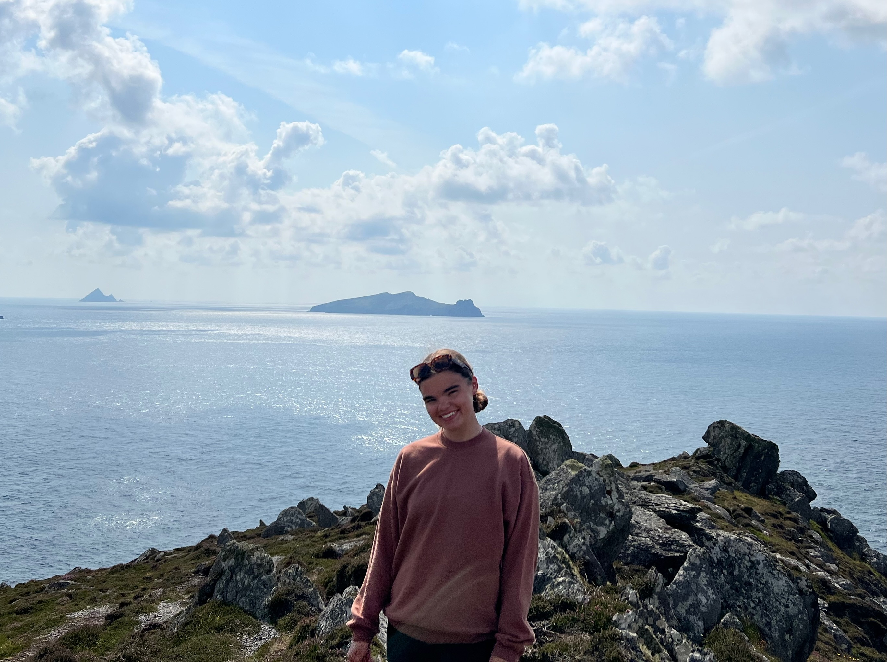
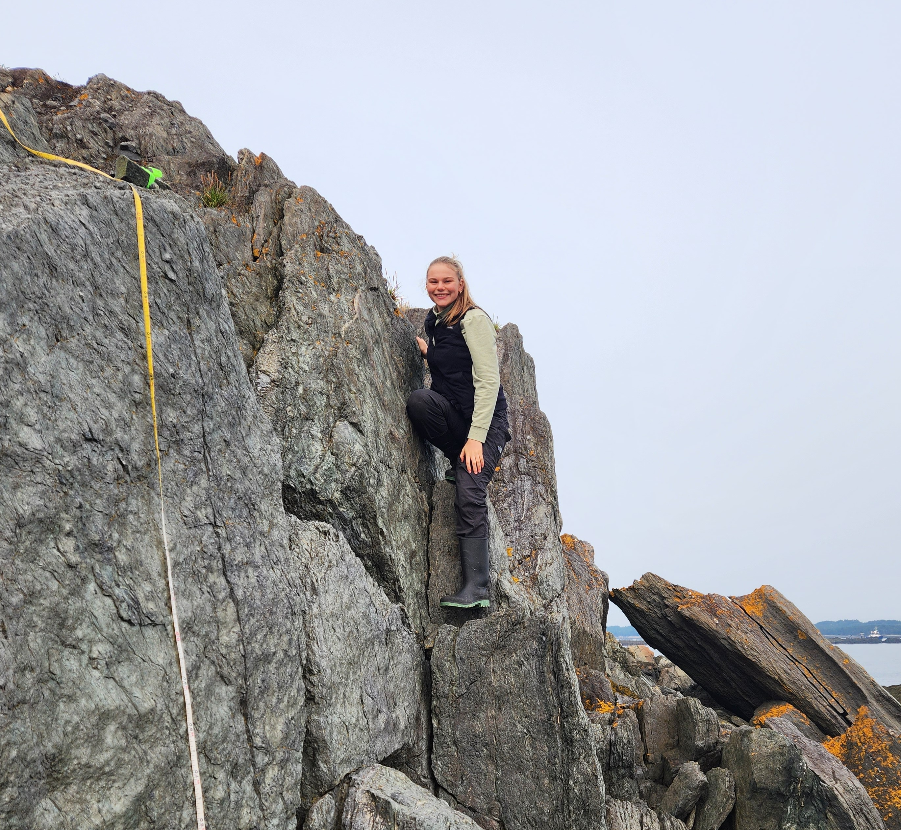
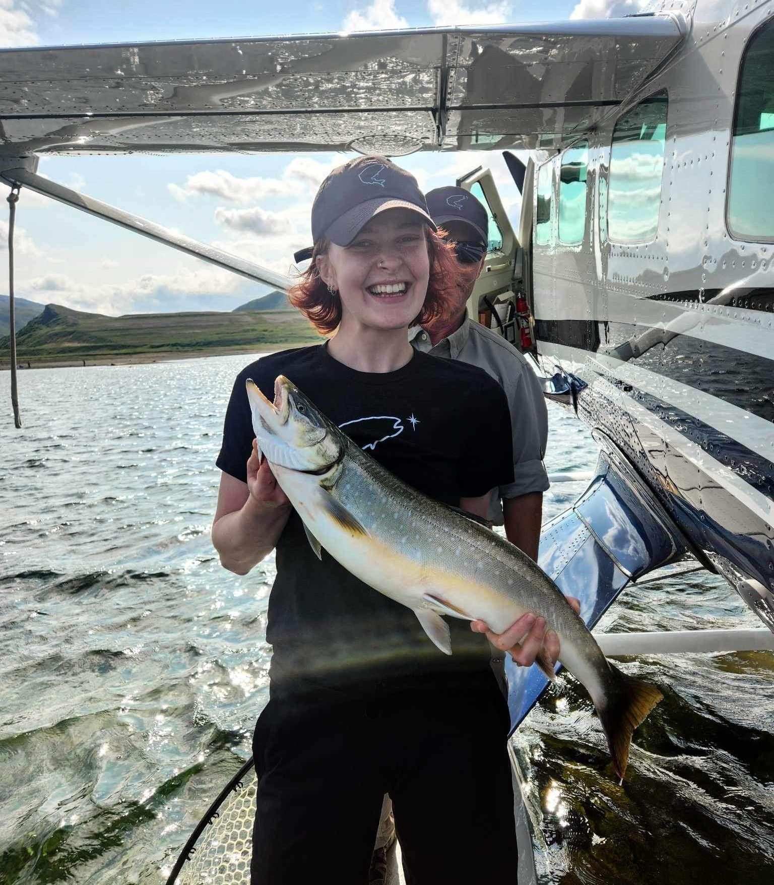

### Dr. Ian A. Fleming

I am a Professor of Evolutionary Ecology in the Department of Ocean Sciences. Prior to joining Memorial University in 2004 as Director of the Ocean Sciences Centre, I was an Associate Professor at Oregon State University stationed at the Hatfield Marine Science Centre from 2001-2004. Before that I was a Research Scientist at the Norwegian Institute for Nature Research in Trondheim from 1991-2001, initially serving as a Postdoctoral Fellow for the first two years. I did my PhD at the University of Toronto on selection during breeding in Pacific salmon and ramifications for artificial propagation. My MSc at Simon Fraser University examined the evolution of breeding life history and morphology in coho salmon, and my BSc was at Queen’s University. It is my passion for the outdoors and nature that drew me into the biological sciences.

## Current Lab Members

#### Victoria Heath

I am a Ph.D. candidate co-supervised by Dr. Sarah Lehnert from DFO. I started in September of 2022, and my work examines the mechanisms of rapid adaption to predict responses to climate change in Atlantic Salmon parr. Specifically, I am looking at Atlantic Salmon parr's structural and functional genetics (DNA and RNA) associated with elevated thermal stress. I also use CTmax experiments to examine the genotype-phenotype association of Atlantic Salmon parr. My field research occurs in multiple rivers and streams around Newfoundland and Labrador.

#### Caroline Ofusu

I am a Ph.D. candidate who is co-supervised by Dr. Susan Ziegler. My research assesses the marine thermal habitat use, diet, growing patterns, and energetic status of anadromous Arctic char populations along the coast of Labrador. I am particularly interested in understanding how these remarkable creatures are likely to adapt and thrive in an ever-changing climate. My research is part of the Sustainable Nunatsiavut Futures (SNF) project, and I partner with a dynamic team of experts and community members, including the Nunatsiavut Government (NG), Inuit research coordinators (IRCs), the Department of Fisheries and Oceans Canada (DFO), the Torngat Secretariat, and local fishers within the Nunatsiavut communities to undertake this study. Together, we hope to gain valuable insights into these char populations and contribute towards building a sustainable future for the communities that rely on them.

#### Hallie Arno
{width="340"}

I am a PhD candidate co-supervised by Dr. Ian Bradbury and Dr. Sarah Lehnert. My research investigates the impacts of two anthropogenic threats to Atlantic salmon: climate change and introgression from aquaculture escapees. Do these two threats multiply or mitigate one another? I am primarily using a population genomics approach, using whole-genome sequencing of aquaculture and wild salmon to better understand questions of local adaptation, the impacts of domestication selection, and changes in fitness resulting from introgression. I am broadly interested in using genetics as a tool for fisheries conservation, and Newfoundland salmon are an ideal study species for these types of questions. 

#### Cameron MacPhail

{width="340"}

I am a MSc candidate co-supervised by Dr. Ian Fleming (Memorial University) and Dr. Ian Bradbury (DFO/Dalhousie). My research aims to clarify the genetic and ecological underpinnings of migratory life history in Atlantic salmon. Specifically, I’m taking advantage of a natural experiment where an enhancement project brought resident and anadromous Atlantic salmon ecotypes into contact in the Rocky River, Newfoundland. Using whole-genome sequencing, I explored the genetic variation associated with the native resident and introduced anadromous populations, as well as in the source of the introduction and a nearby source/sink of strays. I am also using spatial analyses and linear modelling to understand the ecological niches of these coexisting ecotypes and whether they can limit each other’s abundance and distribution through competition. This topic is little explored in this species, and results are revealing exciting patterns that will inform the conservation strategies for both of these migratory morphs.

#### Kiley Sims

{width="423"}

I am an MSc student co-supervised by Dr. Sarah Lehnert (DFO) and am researching hybridization between Atlantic salmon (Salmo salar) and brown trout (Salmo trutta) on the Avalon Peninsula, Newfoundland. My study combines genetic identification and morphological analyses to quantify present-day hybridization rates and compare them with estimates from 30 years ago. I am also examining how the direction of hybridization affects morphological variation in hybrid individuals.

#### Abigail Scher

{width="361"}

I am a MSc Student co-supervised by Dr. Ian Bradbury. I am using whole genome approaches to infer the ancestral history of brown trout in Newfoundland, where three strains were introduced nearly a century and a half ago, and have since been colonizing along the northern and southern sides of the province. I am also investigating what role selection and adaptation has played in genomic change across the landscape with particular emphasis on variability between the northern and southern lineages.

#### Julianna Dyke

{width="361"}

I am an MSc student co-supervised by Dr. Ian Bradbury (DFO). My research focuses on marine survival in Atlantic salmon and is conducted as part of the Atlantic Salmon Research Joint Venture (ASRJV). I am working to identify ecologically induced genetic changes associated with marine mortality in wild Atlantic salmon populations. Additionally, I study gene expression in juvenile salmon within freshwater environments to explore how freshwater conditions influence marine survival. My field work occurs primarily within the Restigouche River, in partnership with the Gespe’gewa’gi Institute of Natural Understanding (GINU).

#### Chloe Baker

{width="316"}

I am an Undergraduate Honours student co-supervised by Dr. Chris Parrish. My research examines the differences in fatty acid and lipid profiles between young-of-the-year Atlantic salmon and brown trout in two ecologically different streams on the Avalon Peninsula of Newfoundland and Labrador. I will be analyzing samples from an anadromous population in Salmon Cove, NL, and from a resident (landlocked) population in the Goulds, NL. My work aims to understand the diet differences or resource partitioning strategies between native Atlantic salmon and the introduced brown trout, especially early in life when interspecific competition would be the highest.

### Frequent Collaborators
[**Dr. Ian Bradbury**](https://bradburygeneticslab.com/people/ian-bradbury/) Research Scientist, Department of Fisheries and Oceans\
[**Dr. Sarah Lehnert**](https://lehnertsarah.wixsite.com/mysite) Research Scientist, Department of Fisheries and Oceans\

## Past Lab Members

### Postdoctoral Researchers

[**Blair Adams**](https://whc.org/about/b-adams/) Director, Wildlife Division, Government of Newfoundland and Labrador\
[**Sigurd Einum**](https://www.ntnu.edu/employees/sigurd.einum) Professor, Norwegian University of Science and Technology, Trondheim\
[**Mohamed Emam**](https://www.researchgate.net/profile/Mohamed-Emam-15) Postdoctoral Fellow, Memorial University of Newfoundland, St. John’s\
[**Melissa Evans**](https://www.researchgate.net/profile/Melissa-Evans) Senior Research Biologist, Coldstream Nature-Based Solutions, BC\
[**Erik Heibo**](https://www.researchgate.net/profile/Erik-Heibo) Senior Environmental Advisor, Sweco Consulting, Oslo\
[**Yusuke Koseki**](https://www.ykoseki.net/) Associate Professor, Otsuma Women’s University, Tokyo\
[**José Beirão Santos**](https://sites.google.com/site/josebeiraosantos/home) Research Scientist, Nord University, Bodø, Norway\
[**Xi Xue**](https://www.researchgate.net/profile/Xi-Xue) Research Scientist, Funglyn Inc., Toronto

### PhD Students

[**Kristin Bøe**](https://www.researchgate.net/profile/Kristin-Boe) Research Scientist, Norwegian Veterinary Institute, Trondheim\
[**Heather Bowlby**](https://www.researchgate.net/profile/Heather-Bowlby) Research Lead, Canadian Atlantic Shark Research Laboratory, Bedford Institute of Oceanography, Fisheries and Oceans Canada, Halifax\
[**Sigurd Einum**](https://www.ntnu.edu/employees/sigurd.einum) Professor, Norwegian University of Science and Technology, Trondheim\
[**Shahinur Islam**](https://www.researchgate.net/profile/Shahinur-Islam-2) Postdoctoral Fellow, University of California Davis\
[**Darek Moreau**](http://www.goc411.ca/en/285110/Darek-Moreau) Section Head, Salmon, Bedford Institute of Oceanography, Fisheries and Oceans Canada, Halifax\
[**Kathryn Morton**](https://piscesrpm.com/staff/) President & CEO, Pisces Research Project Management, Halifax\
[**Ingeborg Mulder**](https://www.linkedin.com/in/ingeborg-mulder-b9657860/?originalSubdomain=nl) Chief Ecologist, Rivierenland Water Board, Netherlands\
[**Åslaug Viken**](https://www.linkedin.com/in/aslaug-viken/?originalSubdomain=no) Senior Adviser, Norwegian Biodiversity Information Centre, Trondheim\
[**Peter Westley**](https://uaf.edu/cfos/people/faculty/detail/peter-westley.php) Associate Professor, Lowell A. Wakefield Chair in Fisheries and Ocean Sciences, University of Alaska Fairbanks\
[**Brendan Wringe**](https://www.researchgate.net/profile/Brendan-Wringe) Research Scientist, Bedford Institute of Oceanography, Fisheries and Oceans Canada, Halifax\

### MSc Students
**Mark Young**\
**Coral San Roman**\
[**Michelle Bachan**](https://www.linkedin.com/in/michelle-m-bachan-448190153/?originalSubdomain=ca) Biology Instructional Assistant, Memorial University of Newfoundland, St. John’s\
**Jaclyn Bennett**\
[**Lance Campbell**](https://www.researchgate.net/profile/Lance-Campbell) Fish Biologist, Washington Department of Fish & Wildlife, Olympia, WA\
[**Michelle Caputo**](https://marineconservationecologylab.com/dr-michelle-caputo) Postdoctoral Fellow, Florida Internal University & Rhodes University, South Africa\
[**Sigurd Einum**](https://www.ntnu.edu/employees/sigurd.einum) Professor, Norwegian University of Science and Technology, Trondheim\
[**Samantha Crowley**](https://bradburygeneticslab.com/people/current-students/) PhD student, Dalhousie University, Halifax\
[**Sindy Dove**](https://www.linkedin.com/in/sindy-dove-192803149/?originalSubdomain=ca) Oyster Hatchery Manager, Verschuren Centre for Sustainability, Sydney, NS\
**Sean Gillard**\
[**Ian Hamilton**](https://www.linkedin.com/in/ianhamilton84/?originalSubdomain=ca) Fisheries Biology & Department Head, Lower Fraser Fisheries Alliance, Abbotsford, BC\
**Lisa Krentz**\
**Christopher Lewis** Fisheries Management Biologist, Fisheries and Oceans Canada, Iqaluit\
**Marion Mann** Faculty, Oregon Coast Community College, Newport, OR\
[**Gwyn Mason**](https://www.linkedin.com/in/gwynemason/?originalSubdomain=ca) Halibut Coordinator, Groundfish Management, Fisheries and Oceans Canada, Vancouver\
**Megan Petrie**\
[**Michelle Simms**](https://www.linkedin.com/in/michelllesimms/?originalSubdomain=ca) Wildlife Technician, Salmonier Nature Park, Newfoundland\
[**John Winkowski**](https://www.oldenfish.com/winkowski) PhD student, University of Washington, Seattle\
[**Emily Zimmermann**](https://www.linkedin.com/in/emily-zimmermann-ab602765/) Marine Biologist, Maine Department of Environmental Protection, Augusta, ME\

### Honours Students

**Tristan Hennig**\
[**Krista Oke**](https://kristaoke.weebly.com/) Postdoctoral Fellow, University of Alaska Fairbanks\
**Emily Palmer**\
**Isaiah Power Smith**
